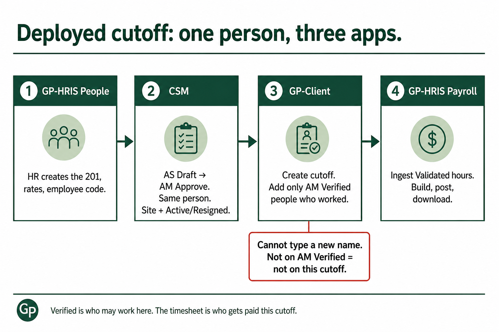
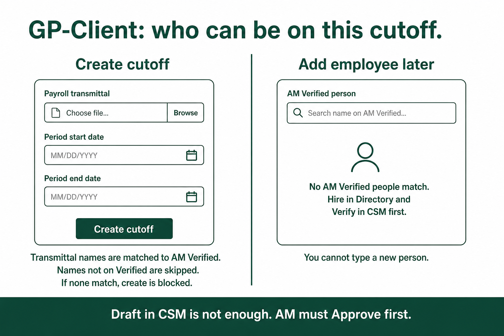
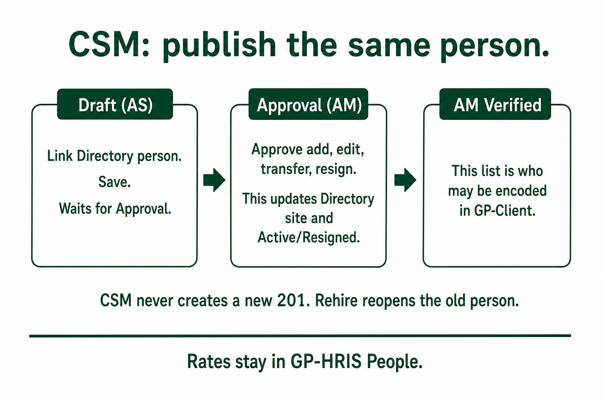

# Deployed cutoff — worker walkthrough

**Short rule:** CSM says who is deployed where. GP-HRIS keeps the person and the pay. The timesheet says who gets paid this cutoff.

This is for **Deployed** client sites only. Organic / office staff skip CSM and GP-Client. They use Clock inside GP-HRIS.

---

## Yes — GP-Client only adds AM Verified

When the timesheet Client is **linked to a Directory site**:

1. **Create cutoff** — you upload a payroll transmittal. Names are matched to **AM Verified**. Names not on Verified are skipped. If **none** match, create is blocked (“Verify them in CSM first”).
2. **Add employee later** — the form is **AM Verified person**. You search; you cannot type a new name.

Draft in CSM is not enough. AM must **Approve** first.

---

## The six steps

| Step | App | Who | What they do | Open |
|---|---|---|---|---|
| 1 | GP-HRIS People | HR | Create the 201, employee code, rates | [People](https://timelog.greenpasture.ph/people) |
| 2 | CSM Draft | AS | Pick the existing 201 onto Draft | [Draft](https://csm.greenpasture.ph/draft) |
| 3 | CSM Approval | AM | Approve add / edit / transfer / resign | [Approval](https://csm.greenpasture.ph/approval) |
| 4 | GP-Client | Timekeeping | Create the cutoff. Add only Verified people who **worked** | [Payroll](https://payroll.greenpasture.ph) |
| 5 | GP-Client | Encoder → Payroll → HR | Encode hours until **Validated** | same |
| 6 | GP-HRIS Payroll | Payroll | Ingest hours, build register, post, download files | [Payroll](https://timelog.greenpasture.ph/payroll) |

Approve updates the **same** Directory person: site, Active, or Resigned. Rehire reopens the old 201. It does not make a new one.

---

## What each list means

| List | Meaning |
|---|---|
| **AM Verified** | Who may work at this site. Not the DTR. |
| **GP-Client Period** | Who has a timesheet this cutoff. Must already be Verified. |
| **Posted register** | Who is paid. Built from Validated hours. |

| Situation | What happens |
|---|---|
| Verified + hours | Paid |
| Verified, no hours this cutoff | Stays Verified. **Not** on timesheet or payroll |
| Hours, not Verified | **Forbidden** |
| Draft name, no 201 | Cannot add. HR creates the person in People, then AS picks that 201 |
| Posted payroll is wrong (hours/people) | GP-Client Adjustment Period → ingest Adjustment cutoff → separate register. Do not edit the posted run |

---

## You can

- **AS:** Draft add from Directory / edit / transfer / resign. You pick the existing 201; you cannot type a new person.
- **AM:** Approve or reject. Approve is what updates Directory (site + Active/Resigned).
- **HR:** Own the 201, rates, and employee code in People.
- **Timekeeping:** Encode hours in GP-Client for Verified people only.
- **Payroll:** Pay from the Validated timesheet in GP-HRIS.

## You cannot

- Create a new 201 from CSM (including rehire, transfer, or resign).
- Approve someone who is not linked to Directory.
- Change daily rate / pay from CSM. Rates stay in GP-HRIS.
- Treat AM Verified as the DTR.
- Add a timesheet name who is not AM Verified.
- Encode DTR or compute net pay in CSM.
- Edit a posted payroll.

---

## Screen copy to show in a demo

**CSM Draft** — field **Directory person**. Save waits for Approval.

**CSM AM Verified** — published headcount for that site.

**GP-Client Add employee** (linked site):

> Add someone who worked this cutoff from AM Verified. Do not type a new person — hire in Directory, then Verify in CSM.

Search placeholder: **Search name on AM Verified…**

If they are missing: **No AM Verified people match. Hire in Directory and Verify in CSM first.**

**GP-Client Create cutoff** — payroll transmittal is required. Unverified names never land on the Period.

**GP-HRIS Payroll hub** — Deployed cutoffs come from GP-Client ingest, then register and downloads. No office Clock aggregate on those cutoffs.
