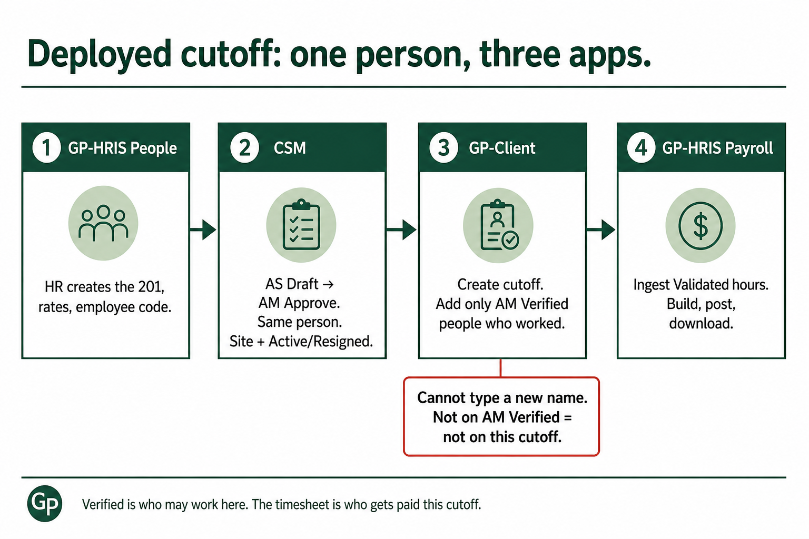
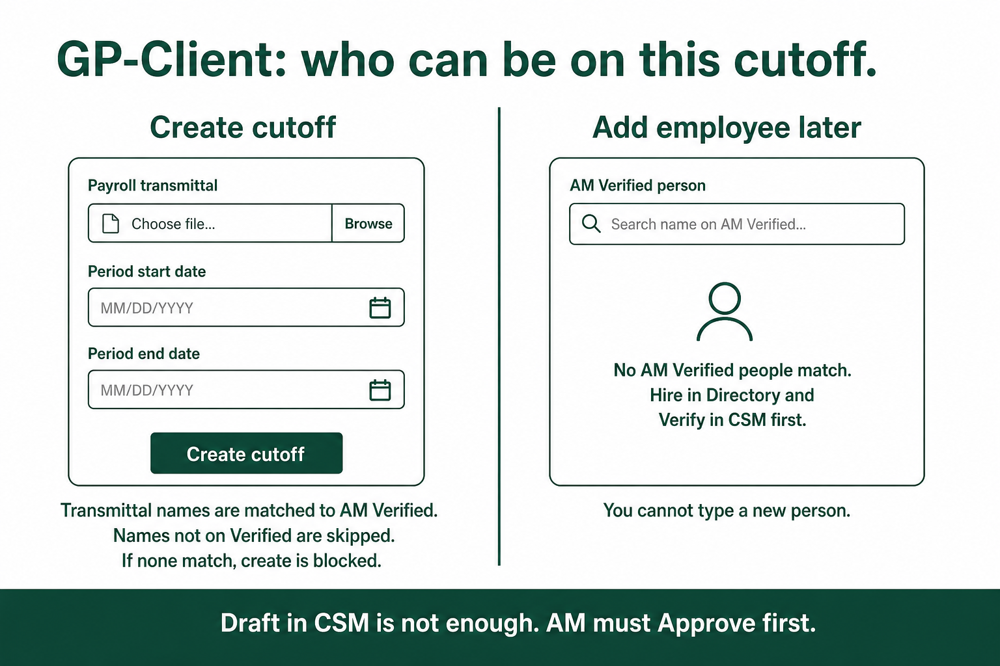
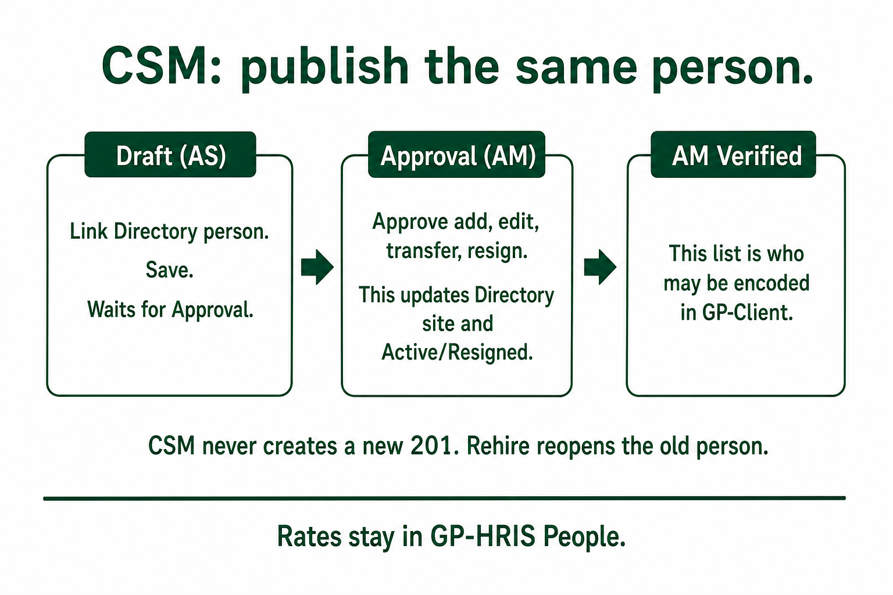

# Deployed cutoff — worker walkthrough

**Short rule:** CSM says who is deployed where. GP-HRIS keeps the person and the pay. The timesheet says who gets paid this cutoff.

This is for **Deployed** client sites only. Organic / office staff skip CSM and GP-Client. They use Clock inside GP-HRIS.

---

## Yes — GP-Client only adds AM Verified

When the timesheet Client is **linked to a Directory site**:

1. **Open cutoff** — the assigned monitor opens it from CSM. No transmittal. The pay format is copied from the last cutoff, or from the format saved on the client when it has never had one.
2. **Add who worked** — the form is **AM Verified person**. You search; you cannot type a new name. If the person is not on file, the Account Supervisor sends a 201 alert and HR inputs the 201 in People.

Draft in CSM is not enough. AM must **Approve** first.

---

## The six steps

| Step | App | Who | What they do | Open |
|---|---|---|---|---|
| 1 | GP-HRIS People | HR | Create the 201, employee code, rates | [People](https://timelog.greenpasture.ph/people) |
| 2 | CSM Draft | AS | Pick the existing 201 onto Draft | [Draft](https://csm.greenpasture.ph/draft) |
| 3 | CSM Approval | AM | Approve add / edit / transfer / resign | [Approval](https://csm.greenpasture.ph/approval) |
| 4 | CSM | Assigned monitor | Open timekeeping for this site | [Clients](https://csm.greenpasture.ph/clients) |
| 5 | GP-Client | Encoder → Payroll → HR | Add who worked. Encode hours until **Validated** | [Payroll](https://payroll.greenpasture.ph) |
| 6 | GP-HRIS Payroll | Payroll | Hours are already there. Build, post, then Send payslips | [Payroll](https://timelog.greenpasture.ph/payroll) |

Approve updates the **same** Directory person: site, Active, or Resigned. Rehire reopens the old 201. It does not make a new one.

---

## What each list means

| List | Meaning |
|---|---|
| **AM Verified** | Who may work at this site. Not the DTR. |
| **GP-Client Period** | Who has a timesheet this cutoff. Must already be Verified. |
| **Posted register** | Who is paid. Built from Validated hours. |

| Situation | What happens |
|---|---|
| Verified + hours | Paid |
| Verified, no hours this cutoff | Stays Verified. **Not** on timesheet or payroll |
| Hours, not Verified | **Forbidden** |
| Draft name, no 201 | Cannot add. HR creates the person in People, then AS picks that 201 |
| Posted payroll is wrong (hours/people) | GP-Client adjustment period, validated, then its own register. Do not edit the posted run |
| No email on the 201 | Payslip Send skips that person and lists the name. The portal payslip still works |

---

## You can

- **AS:** Draft add from Directory / edit / transfer / resign. You pick the existing 201; you cannot type a new person.
- **AM:** Approve or reject. Approve is what updates Directory (site + Active/Resigned).
- **HR:** Own the 201, rates, and employee code in People.
- **Timekeeping:** Encode hours in GP-Client for Verified people only.
- **Payroll:** Pay from the Validated timesheet in GP-HRIS.

## You cannot

- Create a new 201 from CSM (including rehire, transfer, or resign).
- Approve someone who is not linked to Directory.
- Change daily rate / pay from CSM. Rates stay in GP-HRIS.
- Treat AM Verified as the DTR.
- Add a timesheet name who is not AM Verified.
- Encode DTR or compute net pay in CSM.
- Edit a posted payroll.

---

## Screen copy to show in a demo

**CSM Draft** — field **Directory person**. Save waits for Approval.

**CSM AM Verified** — published headcount for that site.

**GP-Client Add employee** (linked site):

> Add someone who worked this cutoff from AM Verified. Do not type a new person — hire in Directory, then Verify in CSM.

Search placeholder: **Search name on AM Verified…**

If they are missing: **No AM Verified people match. Hire in Directory and Verify in CSM first.**

**CSM Open timekeeping** — the assigned monitor confirms dates. Pending Draft is named and is not eligible until AM Approve.

**GP-HRIS Payroll hub** — Validated hours are already on the cutoff. One site pays alone. Several sites share a register only when the pay format matches. After post, Send emails one payslip per person.
