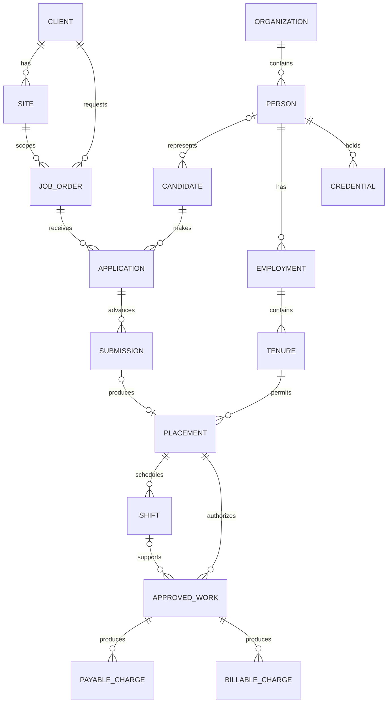
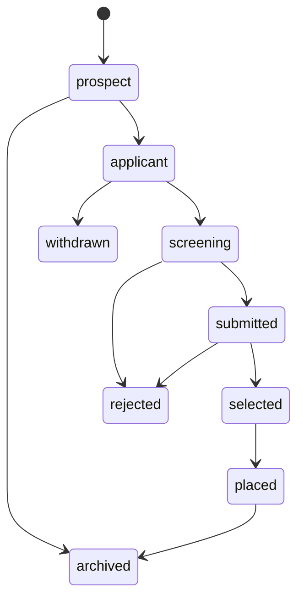
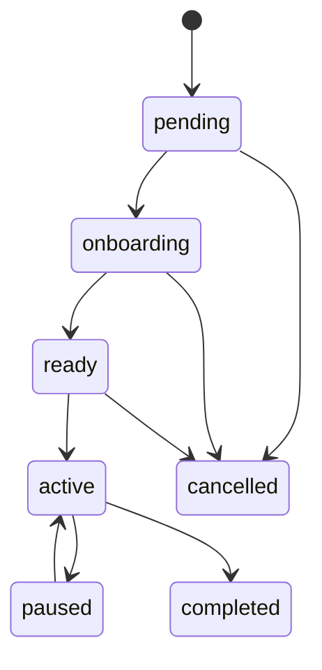

# Platform data model

**Status:** Target logical and physical model  
**Architecture:** [PLATFORM_TARGET_ARCHITECTURE.md](./PLATFORM_TARGET_ARCHITECTURE.md)

This model turns the candidate-to-bill lifecycle into explicit aggregates while preserving current Directory UUIDs, sibling projections, cutoff hours, posted payroll, and billing history.

## 1. Modeling conventions

### Identity

- Primary keys are opaque UUIDs generated by the owning database.
- Every tenant-owned root has `organization_id`.
- Cross-product references store the canonical UUID but do not declare a database foreign key.
- `directory.employees.id` remains the canonical Person ID. APIs and existing tables may continue to name it `directory_employee_id`.
- `directory.client_branches.id` becomes the canonical Site ID. Existing storage and APIs may continue to name it `branch_id`.
- Product-local and legacy keys are recorded in an external-reference registry. A name is never a key.

### Dates and time

- Employment, placement, rate, and business windows use Philippine business dates in `DATE` columns.
- A date range is half-open: `[valid_from, valid_to)`. `valid_to IS NULL` means open-ended.
- Existing inclusive fields such as `resign_date`, `period_end`, and `ends_on` remain compatibility fields. Adapters convert them explicitly; they do not mix conventions inside one aggregate.
- Events, approvals, and audits use `TIMESTAMPTZ` in UTC.
- Roots include `created_at`, `updated_at`, and integer `version`. Commands update with `WHERE version = expected_version`.

### Amounts and quantities

- Hours use `NUMERIC(9,2)`.
- Rates use `NUMERIC(12,4)`.
- Posted currency amounts use `NUMERIC(14,2)` and a `currency_code`, initially `PHP`.
- Financial rows store the calculation quantity, unit, effective rate, rounded amount, rule version, and source lineage.
- JSON may retain calculation detail or compatibility output, but identity, status, dates, money totals, and foreign keys are typed columns.

### Deletion

- Workflow and financial roots are not hard-deleted after publication.
- Draft records may be canceled or archived.
- Personally identifiable data follows an approved retention or anonymization process; deleting a Person cannot cascade through posted financial history.

## 2. Conceptual model



Candidate may exist before identity is sufficiently verified to create or link a Person. Person linkage is mandatory before Employment, Placement activation, ApprovedWork, or pay.

## 3. Context placement

| Entity | Owning product and database | Target physical record |
|---|---|---|
| Person | GP-HRIS Supabase | `directory.employees` |
| Candidate | GP-HRIS Supabase | `directory.candidates` |
| Employment | GP-HRIS Supabase | `directory.employments` |
| Tenure | GP-HRIS Supabase | `directory.employment_tenures` |
| Client | GP-HRIS Supabase | `directory.clients` |
| Site | GP-HRIS Supabase | `directory.client_branches` |
| Position and rate versions | GP-HRIS Supabase | `directory.positions`, target `directory.position_rate_versions` |
| JobOrder | CSM Supabase | target `job_orders` |
| Application | CSM Supabase | target `applications` |
| Submission | CSM Supabase | target `submissions` |
| Placement | GP-HRIS canonical ledger; CSM workflow projection | `directory.placements`; CSM stores its local ID and `directory_placement_id` |
| Credential | GP-HRIS Supabase | target `directory.credentials` |
| Shift | GP-Client for Deployed; GP-HRIS Time for Organic | source-local `shifts` with canonical envelope |
| WorkApproval | Owning time product | target source-local `work_approvals` |
| ApprovedWork | Owning time product; accepted projection in GP-HRIS | target source-local `approved_work`; `public.cutoff_hours` remains payroll projection |
| PayableCharge | GP-HRIS Supabase | target `public.payable_charges`; projected into `payroll_register_lines` |
| BillableCharge | GP-HRIS Supabase | target `public.billable_charges`; projected into `billing_lines` |

Placement is intentionally split by responsibility: CSM owns the operational decision and AM Verified publication; GP-HRIS owns the canonical effective-dated assignment accepted by employment, time, pay, and billing.

## 4. Core entities

### 4.1 Person

**Meaning:** One durable human identity and 201 file within an Organization.  
**Current storage:** `directory.employees`; `id` is `person_id`.

Required target fields:

- `id`, `organization_id`
- stable `employee_code` when issued
- legal and preferred names
- birth and contact fields
- government, bank, and pay-through identifiers
- privacy classification and retention state
- `current_tenure_id`, `current_placement_id` as projections only
- `version`, `created_at`, `updated_at`

Rules:

- Unique non-null `(organization_id, employee_code)`.
- Government identifiers are normalized, encrypted where required, and uniqueness-checked only under an approved matching policy.
- Rehire never inserts a new Person.
- Current client, site, position, status, hire date, and rate columns on `directory.employees` are compatibility projections, not historical authority.
- `public.employees` remains Bundy and portal enrollment linked by `directory_employee_id`; it is not Person.

### 4.2 Candidate

**Meaning:** Recruiting profile for a prospective or returning worker. Candidate state is neither Person identity nor employment state.  
**Storage:** `directory.candidates`.

Minimum fields:

- `id`, `organization_id`, `candidate_number`
- nullable `employee_id` as Person link until identity is resolved
- name and contact intake fields
- `source`, `available_from`
- `consent_status`, `consent_recorded_at`
- `status`
- `version`, timestamps

Status transitions:



Rules:

- Unique `(organization_id, candidate_number)`.
- Multiple Candidate profiles may resolve to one Person only after duplicate review; future applications normally reuse the existing Candidate.
- `placed` requires a Person link and accepted Placement.
- Withdrawal or rejection does not deactivate Person or Employment.

### 4.3 Employment

**Meaning:** Stable relationship between Person and Green Pasture as legal employer.  
**Storage:** `directory.employments`.

Minimum fields:

- `id`, `organization_id`, `employee_id`
- `worker_type`
- `status`
- `original_hire_date`, `ended_at`
- `version`, timestamps

Rules:

- Initial implementation is unique on `(organization_id, employee_id)`.
- Worker type is one of `employee`, `contractor`, or `contingent`.
- Employment status is `pending`, `active`, `inactive`, or `ended`.
- Employment owns the ordered Tenure sequence. Client assignment belongs to Placement, not Employment.
- A future legal-employer split requires an explicit `legal_employer_id` and revised uniqueness constraint; it must not overload Client.

### 4.4 Tenure

**Meaning:** One sequential service episode under an Employment, from hire through exit.  
**Storage:** `directory.employment_tenures`.

Minimum fields:

- `id`, `organization_id`, `employment_id`, compatibility `employee_id`
- monotonic `sequence`
- `hire_date`, nullable `resign_date`
- `status`, `is_current`, `closed_at`
- frozen final-pay status and barred reason
- compatibility snapshots for client, site, position, payroll rate, and billing rate
- `version`, timestamps

Rules:

- Unique `(employment_id, sequence)`.
- Partial unique index allows one `is_current = true` Tenure per Employment.
- A closed Tenure is immutable except append-only audit metadata.
- Rehire closes the current Tenure and opens `sequence + 1` in one GP-HRIS transaction.
- Final-pay barred is a closed-Tenure result. Deployment barred is a hold on a current Tenure.
- Tenure and Placement date ranges must overlap for a Placement to activate.

### 4.5 Client

**Meaning:** Customer, pay-policy boundary, and billing party within an Organization. Organic uses a house Client of the same shape but is not billable.  
**Storage:** `directory.clients`.

Minimum target fields:

- `id`, `organization_id`, legal and display names
- tax and billing contacts
- lifecycle status
- `client_kind`: `organic_house` or `deployed`
- pay calendar and statutory policy references
- billing policy reference and output pack
- `bundy_enabled`
- `version`, timestamps

Rules:

- Distinct legal customers remain distinct Clients.
- Several Sites may belong to one Client.
- Pay calendar, statutory policy, and billing policy are effective-dated versions; live columns remain projections during transition.
- `organic_house` rejects BillingRun creation.

### 4.6 Site

**Meaning:** Physical or operational work location under a Client; current name is Branch.  
**Storage:** `directory.client_branches`.

Minimum target fields:

- `id`, `organization_id`, `client_id`
- `code`, `name`, address or location
- timezone, initially `Asia/Manila`
- lifecycle status
- `valid_from`, `valid_to`
- `version`, timestamps

Rules:

- `client_id` is immutable after use by Placement or approved work.
- CSM outlet and GP-Client site bind to `site_id`.
- `directory.client_departments` remains a store or grouping catalog and is not Site or payroll scope.

### 4.7 JobOrder

**Meaning:** Versioned customer demand for workers at a Client and Site.  
**Owner:** CSM-GP.

Minimum fields:

- `id`, `organization_id`
- `client_id`, `site_id`, `position_id`
- `order_number`, `status`, `demand_quantity`
- `requested_start_date`, nullable `requested_end_date`
- schedule and requirement summary
- payroll and billing term references or approved snapshots
- `opened_by`, `approved_by`, approval timestamp
- `version`, timestamps

Status transitions:

`draft -> open -> on_hold -> open -> filled -> closed`, with `draft -> cancelled` and `open -> cancelled`.

Rules:

- `demand_quantity > 0`.
- New Applications require `open`.
- Active Placement count cannot exceed demand without an authorized quantity revision.
- A revision changes the JobOrder version; an accepted Submission keeps the terms version it used.
- The Client, Site, and Position must share `organization_id`, and Site must belong to Client.

### 4.8 Application

**Meaning:** Candidate interest in one JobOrder and the internal screening workflow.  
**Owner:** CSM-GP.

Minimum fields:

- `id`, `organization_id`, `candidate_id`, `job_order_id`
- `status`, source, applied timestamp
- screening outcome, owner, notes classification
- `version`, timestamps

Rules:

- Unique open application on `(candidate_id, job_order_id)`.
- Candidate and JobOrder must belong to the same Organization.
- Application cannot reach client-submitted state directly; it creates a Submission.
- Rejection and withdrawal are terminal for that Application, not for Candidate.

### 4.9 Submission

**Meaning:** Immutable snapshot of a Candidate presented to a Client for one JobOrder, with the Client decision.  
**Owner:** CSM-GP.

Minimum fields:

- `id`, `organization_id`, `application_id`, `candidate_id`, `job_order_id`
- `submission_number`, `revision`
- submitted profile snapshot and credential summary
- `status`, `submitted_at`, decision timestamp and reason
- `client_contact_id`, owner
- `version`, timestamps

Status transitions:

`draft -> submitted -> interviewing -> accepted` or `rejected`; `draft -> cancelled`; `submitted -> withdrawn`.

Rules:

- Unique `(application_id, revision)`.
- Facts sent to the Client are frozen on submit.
- Acceptance requires the JobOrder still permits fulfillment or an explicit override.
- At most one active Placement may originate from one accepted Submission.

### 4.10 Placement

**Meaning:** Effective-dated assignment of a Person under a Tenure to a Client, Site, and Position.  
**Canonical storage:** `directory.placements`.

Minimum fields:

- `id`, `organization_id`, `employee_id`, `employment_id`, nullable `tenure_id`
- `client_id`, `branch_id`, `position_id`
- cross-database `external_job_order_id` and `external_submission_id`
- `source_app`
- `status`
- `starts_on`, nullable `ends_on`
- `payroll_rate_version_id`, `billing_rate_version_id`
- migration-compatible payroll and billing rate snapshots
- `compliance_status`, `is_primary`, `ended_reason`
- `version`, timestamps

Status transitions:



Rules:

- `ends_on >= starts_on` under the existing inclusive convention.
- Person, Employment, and Tenure must represent the same human and Organization.
- Site and Position must belong to Placement Client.
- Activation requires a current effective Tenure, compliance readiness, and an accepted demand source unless `source_app = migration`.
- One partial unique index permits one primary ready, active, or paused Placement per Person during the initial non-concurrent model.
- Transfer is not an in-place rewrite of history. Close the effective segment and create the succeeding segment or append a Placement movement that materializes those segments.
- A second Position in one cutoff is an ApprovedWork assignment, not necessarily a second primary Placement.

### 4.11 Credential

**Meaning:** Evidence that a Candidate or Person meets an identity, legal, training, medical, or client requirement.  
**Owner:** GP-HRIS.

Minimum fields:

- `id`, `organization_id`
- nullable `candidate_id`, nullable `employee_id`
- `credential_type_id`
- document reference and encrypted metadata
- `issued_on`, `expires_on`
- `status`: `pending`, `verified`, `rejected`, `expired`, `revoked`
- verifier, verification timestamp, rejection or revocation reason
- `version`, timestamps

Rules:

- Exactly one of Candidate or Person is the current subject; linking identity transfers or relates the credential through an audited command.
- Verified status requires verifier and timestamp.
- Expiry is derived from `expires_on` but recorded as a transition for audit and notification.
- Placement readiness evaluates requirement versions from the JobOrder and Client; it does not copy binary flags onto Person.
- Object storage paths are private and never appear in cross-product events.

### 4.12 Shift

**Meaning:** Planned work interval for one Placement and assignment.  
**Owner:** GP-Client for Deployed; GP-HRIS Time for Organic.

Minimum fields:

- `id`, `organization_id`, `placement_id`, `person_id`
- `client_id`, `site_id`, `position_id`
- local schedule ID
- planned start and end timestamps, timezone
- status: `planned`, `published`, `in_progress`, `completed`, `cancelled`
- source version and timestamps

Rules:

- Planned end is after planned start.
- Shift falls within effective Placement dates.
- Overnight shifts retain timestamps; they are not split merely at midnight.
- Shift is optional for manual DTR and adjustments. ApprovedWork can cite other evidence.
- Canceling a Shift after work approval does not delete ApprovedWork.

### 4.13 WorkApproval and ApprovedWork

**Meaning:** WorkApproval is the human gate and publication batch. ApprovedWork is an immutable payable work line in that batch.  
**Owner:** The source time product.

WorkApproval fields:

- `id`, `organization_id`, source product and local period ID
- `client_id`, `site_id`, period dates
- `approval_version`
- `status`: `draft`, `submitted`, `approved`, `superseded`, `rejected`
- submitter, approver, timestamps
- nullable `supersedes_work_approval_id`
- payload hash and correlation ID

ApprovedWork fields:

- `id`, `work_approval_id`, `organization_id`
- `person_id`, `employment_id`, `tenure_id`, `placement_id`
- `client_id`, `site_id`, `position_id`
- nullable `shift_id`
- work date or cutoff range
- premium-hour matrix
- allowance and structured earning inputs that Time is authorized to determine
- evidence references, source row ID, source version
- `created_at`

Rules:

- Unique source identity `(source_system, source_period_id, source_row_id, approval_version)`.
- Unique assignment within a regular approval follows `(work_approval_id, person_id, position_id, site_id)`, with a deliberate extra discriminator if multiple work dates are retained.
- Approved lines cannot change. Correction creates a new WorkApproval version and marks the prior batch superseded.
- Only one approved, non-superseded version is current per source period.
- All IDs must be effective for the work date. A sister-Site transfer during a cutoff remains valid when the Placement segment or approved assignment proves the prior Site.
- Deployed approval requires AM Verified eligibility. Organic approval requires the Clock audit gate.
- GP-HRIS ingestion stores `approved_work_id`, `placement_id`, and version on the accepted record while continuing to materialize `cutoff_hours`.

### 4.14 PayableCharge

**Meaning:** One normalized worker-side earning, deduction, employer contribution, or informational payroll component.  
**Owner:** GP-HRIS Payroll.

Minimum fields:

- `id`, `organization_id`
- `payroll_run_id`, `payroll_register_line_id`
- `person_id`, `employment_id`, `tenure_id`, nullable `placement_id`
- nullable `approved_work_id`
- `charge_type`, `component_code`
- `quantity`, `unit`, `rate`, `amount`, `currency_code`
- `rate_version_id`, `rule_version`
- `tax_treatment`, `statutory_treatment`
- `source_charge_id` for reversal or adjustment lineage
- `created_at`

Rules:

- A run line may contain many PayableCharges; remittance still groups by Person.
- Work-derived charges require ApprovedWork. Loan and statutory charges cite their own source and the same payroll line.
- Same Person with two Positions has separate assignment lines and charges, not a mashed rate.
- Unique consumption guard prevents the same current ApprovedWork line and component from entering two regular posted runs.
- Draft charges may be rebuilt. Posting freezes charges, line totals, loan posts, and source versions.
- An adjustment charge points to the source run or charge and belongs to a separate Adjustment PayrollRun.
- `payroll_register_lines.hours`, `earnings`, `deductions`, and totals remain compatibility projections derived from these charges.

### 4.15 BillableCharge

**Meaning:** One normalized customer-side labor, premium, allowance, employer cost, fee allocation, tax, or adjustment component.  
**Owner:** GP-HRIS Billing.

Minimum fields:

- `id`, `organization_id`
- `billing_run_id`, `billing_line_id`
- `client_id`, `site_id`, `person_id`, nullable `placement_id`
- `approved_work_id` for labor and work-derived components
- nullable `payroll_control_run_id` as release-gate evidence
- nullable `source_register_line_id` for migrated lineage only
- `charge_type`, `component_code`
- `quantity`, `unit`, `rate`, `amount`, `currency_code`
- `billing_rate_version_id`, `rule_version`
- `source_charge_id` for reversal lineage
- `created_at`

Rules:

- Created from Deployed ApprovedWork independently of PayableCharges.
- Finance may post the BillingRun only after the associated payroll control is satisfied.
- Each labor charge traces directly to ApprovedWork; a register-line reference is optional migration evidence, not calculation input.
- Billing rates are independent from payroll rates and are snapshotted at build.
- Employer mandatories, admin fee, VAT, and EWT are explicit component types, not hidden total adjustments.
- A posted BillingRun freezes all BillableCharges and cannot be canceled.
- Before post, a draft may be canceled. After post, corrections use a linked credit or debit Billing Adjustment run.
- Unique `(billing_run_id, approved_work_id, component_code)` where a work source exists.
- `billing_lines.hours`, `amounts`, `labor`, `mandatories`, and `billable` remain compatibility projections.

## 5. Effective dating and rate versions

### Standard period

New effective-dated tables use:

```text
valid_from DATE NOT NULL
valid_to   DATE NULL
CHECK valid_to IS NULL OR valid_to > valid_from
```

The effective row for business date `d` satisfies:

```text
valid_from <= d AND (valid_to IS NULL OR d < valid_to)
```

### Non-overlap

For PostgreSQL tables local to GP-HRIS:

- use `daterange(valid_from, valid_to, '[)')`;
- add a GiST exclusion constraint for the relevant business key;
- use a partial unique index for one open row;
- close the old row and insert the new row in one transaction.

Examples of non-overlapping keys:

- Tenure: `employment_id`
- primary Placement segment: `employment_id` while `is_primary`
- position payroll rate: `position_id`
- position billing rate: `position_id`
- Client pay calendar: `client_id`
- Client statutory policy: `client_id`
- Client billing policy: `client_id`

### Rate selection

1. Determine work date and effective Placement assignment.
2. Resolve the Position payroll or billing rate version effective on that date.
3. Apply an authorized Placement override if its own effective window covers the date.
4. Snapshot selected rate ID, amount, and units on the financial charge.
5. Never recalculate a posted charge merely because a later rate version is entered.

For cutoff-level rates where daily splits are unavailable, the contract must name the agreed rate date, normally the cutoff end date. It cannot silently use “current rate.”

## 6. Aggregate boundaries and write transactions

### Same-database transactions

- Person creation plus aliases and required 201 children.
- Rehire: close Tenure, open new Tenure, update Person projection, append outbox event.
- Placement acceptance: validate identities, create canonical Placement, update current projection, append outbox event.
- Work ingestion: inbox receipt, accepted ApprovedWork projection, cutoff-hours upsert, audit row.
- Payroll post: freeze run and charges, create loan posts, append `payroll.posted`.
- Billing process: create run and charges, freeze totals, append `billing.processed`.

### Cross-database workflows

No cross-database transaction is attempted. Use:

1. idempotent command;
2. local owner transaction;
3. outbox event;
4. consumer inbox deduplication;
5. reconciliation query.

Compensation is a new command or state transition. It is never a direct edit in the consumer's database.

## 7. Database constraints and indexes

Every canonical table should have:

- foreign keys inside its own database;
- `organization_id` included in lookup indexes;
- status and effective-date checks;
- unique source keys for idempotency;
- an index for its primary list route;
- an immutable-row trigger or restricted update function for closed and posted records;
- RLS with service-role writes and organization-scoped user reads where exposed.

Minimum list indexes:

- Person: `(organization_id, status, last_name, first_name, id)`
- Candidate: `(organization_id, status, created_at DESC, id)`
- Tenure: `(organization_id, employment_id, sequence DESC)`
- Placement: `(organization_id, client_id, branch_id, status, starts_on DESC)`
- JobOrder: `(organization_id, status, client_id, requested_start_date DESC)`
- Application: `(organization_id, job_order_id, status, created_at DESC)`
- Submission: `(organization_id, job_order_id, status, submitted_at DESC)`
- Credential: `(organization_id, status, expires_on)`
- ApprovedWork: `(organization_id, client_id, period_end DESC, person_id)`
- PayableCharge: `(organization_id, payroll_run_id, person_id, component_code)`
- BillableCharge: `(organization_id, billing_run_id, site_id, component_code)`

Search columns should use normalized text or trigram indexes for names, codes, email, JobOrder number, Client, and Site. Search endpoints still apply tenant and grant scope before `q`.

## 8. External references and integration lineage

Target registry:

`platform.external_references`

- `id`
- `organization_id`
- `entity_type`
- `canonical_id`
- `source_system`
- `source_key`
- optional `source_parent_key`
- `first_seen_at`, `last_seen_at`
- `metadata`

Unique constraints:

- `(organization_id, source_system, entity_type, source_key)`
- optional `(organization_id, entity_type, canonical_id, source_system, source_key)`

Use it for GREENHRISMAIN IDs, CSM local rows, GP-Client local rows, imported employee codes, and historical aliases. Existing `legacy_id` and sibling UUID columns remain during transition and are backfilled into the registry.

Every accepted integration write also stores:

- `source_system`
- `source_record_id`
- `source_version`
- `idempotency_key`
- `correlation_id`
- payload hash
- received and processed timestamps

## 9. Compatibility mapping

| Current record | Target meaning | Transition rule |
|---|---|---|
| `directory.employees` | Person plus current Engagement projection | Preserve ID; gradually stop treating current assignment columns as history |
| `directory.employment_tenures` | Tenure | Add or use `employment_id`; freeze closed rows |
| `directory.employments` | Employment | One backfilled row per Person in the initial model |
| `directory.candidates` | Candidate | Link to Person only when identity is resolved |
| `directory.placements` | Canonical Placement ledger | Backfill current Engagement as `source_app = migration`; reconcile exceptions |
| `public.employees` | Bundy and portal enrollment | Keep link to Person; never promote it to identity SoT |
| CSM Draft and Verified rows | Demand and AM Verified projections | Add JobOrder and Placement IDs; block Verify without canonical identity |
| GP-Client roster and Period employee | Placement and ApprovedWork projections | Preserve local workflow; add canonical source IDs |
| `cutoff_periods` | Payroll intake and run scope | Keep regular and adjustment kinds |
| `cutoff_hours` | Accepted-work compatibility projection | Add ApprovedWork and Placement lineage; retain premium matrix |
| `payroll_register_runs` | PayrollRun | Preserve posted rows and totals |
| `payroll_register_lines` | Person-assignment register projection | Normalize components into PayableCharges without changing history |
| `billing_runs` | BillingRun | Preserve historical processed and canceled facts; new posted runs are immutable |
| `billing_lines` | Billing projection | Normalize components into BillableCharges, recovering ApprovedWork lineage without changing history |

## 10. Backfill and reconciliation rules

1. Resolve by an existing canonical UUID first.
2. Otherwise resolve GREENHRISMAIN keys through `legacy_id` and Organization.
3. Otherwise resolve stable employee code or alias within Organization.
4. Name matching is a candidate generator only. It requires a unique Client-scoped result and review before assignment.
5. Ambiguous rows enter an unmapped queue with source details and reason.
6. Backfills are rerunnable and use upsert on source reference.
7. Migration-created JobOrders, Submissions, and Placements are labeled `migration`; unknown approvals remain unknown.
8. Existing posted payroll and processed billing amounts are copied as facts. They are not recomputed during normalization.
9. Counts reconcile by Organization, Client, Site, status, cutoff, and source system before a writer is switched.

## 11. Critical invariants

The database and owner services jointly enforce:

- one Person per resolved human;
- one Employment per Person in the initial legal-employer model;
- one current Tenure per Employment;
- immutable closed Tenures;
- Placement dates inside a valid Tenure;
- Client, Site, Position, and Organization consistency;
- Person linkage before Placement activation;
- accepted Submission before non-migration Placement;
- required verified Credentials before Placement readiness;
- AM Verified eligibility before Deployed work approval;
- immutable published ApprovedWork;
- no duplicate regular consumption of ApprovedWork;
- immutable posted PayableCharges;
- no billing for Organic work;
- BillableCharges only from deployed ApprovedWork, with payroll control recorded before Bill post;
- immutable posted BillableCharges;
- adjustment lineage to one posted source run;
- no organization-crossing foreign or external reference.

## 12. Data-model non-goals

- Renaming every existing `employee_id` or `branch_id` column in one migration.
- Making Candidate a second person master.
- Storing a new Person for rehire, transfer, or a second cutoff Position.
- Treating Client, Site, Department, and Position as interchangeable.
- Using free-text names as durable references.
- Replacing raw time evidence with ApprovedWork; both remain, with different owners.
- Storing all payroll and billing components only in JSON.
- Recomputing posted history when rate or statutory rules change.
- Cross-database foreign keys or distributed transactions.
- Modeling unrelated simultaneous Client employments in the first release.
- Deleting financial lineage to satisfy ordinary UI cleanup.
