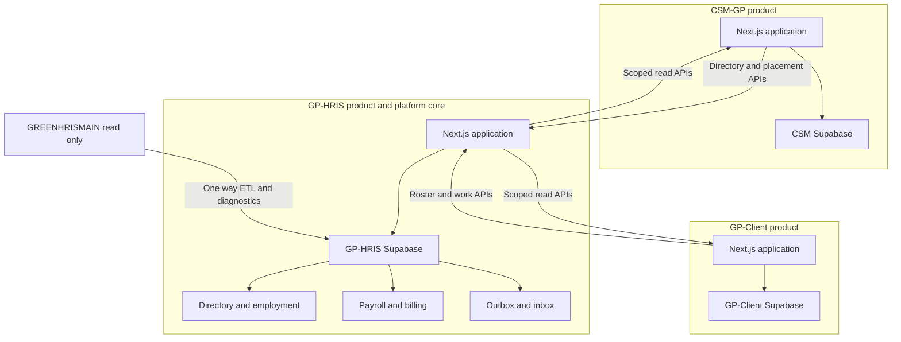
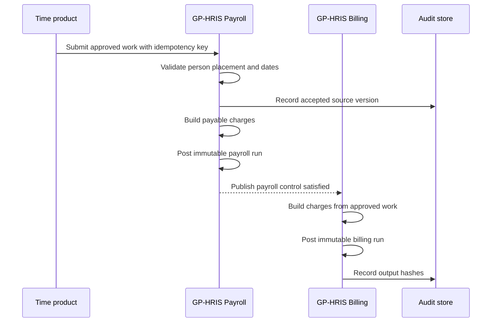

# Platform target architecture

**Status:** Target design  
**Scope:** Three products on one employment platform, from candidate intake through client billing  
**Companion model:** [PLATFORM_DATA_MODEL.md](./PLATFORM_DATA_MODEL.md)

This document extends the accepted decisions in `docs/adr/0001` through `0017`. It does not replace the current integration contracts during transition.

## 1. Target outcome

Green Pasture operates three products with independent workflows and releases:

1. **GP-HRIS** — people, candidate records, 201, employment, tenure, payroll, benefits, reporting, and billing.
2. **CSM-GP** — client demand, job orders, applications, submissions, placements, and published deployed headcount.
3. **GP-Client** — site scheduling, time capture, client-specific DTR rules, and work approval.

They form one platform because they share canonical IDs, explicit ownership, and durable hand-off documents. They do not become one Next.js application or one database.

```mermaid
flowchart LR
  Candidate["Candidate"]
  JobOrder["Job order"]
  Submission["Client submission"]
  Placement["Placement"]
  Shift["Shift and time"]
  ApprovedWork["Approved work"]
  Payable["Payable charges"]
  Payroll["Posted payroll"]
  Billable["Billable charges"]
  Invoice["Client billing"]

  Candidate --> JobOrder
  JobOrder --> Submission
  Submission --> Placement
  Placement --> Shift
  Shift --> ApprovedWork
  ApprovedWork --> Payable
  ApprovedWork --> Billable
  Payable --> Payroll
  Payroll -->|"Release gate"| Billable
  Billable --> Invoice
```



The platform succeeds when every downstream record can be traced to one person, one demand source or approved assignment, one work approval, and one posted financial result without matching by display name.

## 2. Architectural principles

1. **One person namespace.** GP-HRIS Directory owns the human and lifetime employee code. Rehire opens a new Tenure on the same Person.
2. **Organization is the tenant.** Every canonical row carries `organization_id`. Client is a working and commercial boundary, not a database tenant.
3. **Three products keep local autonomy.** Each product owns its workflow state and database. Cross-product writes use authenticated server APIs or an outbox-delivered event.
4. **Documents cross boundaries.** Products exchange IDs and versioned business documents, not shared mutable tables: Placement, ApprovedWork, posted Payroll, and billing results.
5. **Approval creates a new fact.** Draft time is not a ledger input. Validated time creates ApprovedWork; Pay and Bill independently derive charges from that immutable work.
6. **Effective dates preserve history.** Employment, Tenure, Placement, rates, credentials, and site assignments are date-ranged. A current projection may change; closed historical facts do not.
7. **Money is reproducible.** Financial lines retain source IDs, quantity, rate snapshot, rule version, and calculation inputs.
8. **GREENHRISMAIN is a read-only catalog.** It may supply legacy keys, history, and behavior to harvest. It is never a runtime write target or amount oracle.
9. **Access is grant-based.** Pages and Functions authorize actions; organization, client, site, and ownership attributes constrain scope.
10. **Lists are server-side.** Platform list contracts support search, domain filters, bounded pagination, stable ordering, and total count.

## 3. Bounded contexts

### 3.1 Identity and 201

**Owner:** GP-HRIS  
**Core aggregates:** Person, Candidate, Employment  
**Responsibilities:** legal identity, contact details, government and bank identifiers, 201 children, employee code, aliases, privacy controls, and duplicate resolution.

Candidate may exist before identity is sufficiently verified to link a Person. Selection resolves or creates the one Person; conversion never copies the human into a second master.

### 3.2 Employment and tenure

**Owner:** GP-HRIS  
**Core aggregate:** Employment with Tenure episodes  
**Responsibilities:** employer relationship, sequential service episodes, hire and exit, current status, primary position, payroll eligibility, final-pay outcome, and deployment holds.

The existing Engagement is retained as a compatibility read model: the current Tenure plus current primary Placement projected onto the Directory person.

### 3.3 Demand and fulfillment

**Owner:** CSM-GP for demand and decisions; GP-HRIS for the canonical accepted Placement ledger  
**Core aggregates:** Client projection, JobOrder, Application, Submission, Placement  
**Responsibilities:** requested headcount, site and position demand, candidate pipeline, client presentation, acceptance, deployment, transfer, release, and AM Verified publication.

CSM references canonical Person, Client, Site, Position, Employment, Tenure, and Placement IDs. It commands accepted Placement transitions through GP-HRIS and does not create a 201 file.

### 3.4 Work planning and approval

**Owner:** GP-Client for Deployed; GP-HRIS Time for Organic  
**Core aggregates:** Shift, WorkApproval containing ApprovedWork lines  
**Responsibilities:** schedules, punches or encoded DTR, client-specific premium rules, correction workflow, and approval evidence.

Both sources publish the same ApprovedWork contract. Raw punches and client rule flags stay with the producing product.

### 3.5 Pay

**Owner:** GP-HRIS  
**Core aggregates:** CutoffPeriod, PayrollRun, PayableCharge  
**Responsibilities:** consume ApprovedWork, resolve effective payroll rates and statutory policy, calculate earnings and deductions, post immutable registers, and produce payslips, remittance, and bank files.

An Adjustment is a separate run linked to a posted source cutoff. Posted regular and adjustment runs are immutable.

### 3.6 Bill

**Owner:** GP-HRIS  
**Core aggregates:** BillingRun, BillableCharge  
**Responsibilities:** derive deployed customer charges independently from ApprovedWork, apply billing rates and employer cost rules, apply admin fee, VAT, and EWT, and produce SOA and debit memo outputs.

Finance releases billing only after payroll controls for the cutoff are satisfied. This is an operational gate, not a data dependency on PayableCharges. Organic work has no billing twin.

### 3.7 Platform access and audit

**Owner:** GP-HRIS platform services  
**Core aggregates:** User, Grant, ServiceCredential, AuditEvent  
**Responsibilities:** organization membership, Page and Function grants, service authentication, scoped authorization, idempotency records, and cross-product audit correlation.

## 4. Ownership matrix

| Record or decision | System of record | Allowed writers | Consumers |
|---|---|---|---|
| Person and 201 | GP-HRIS Directory | HR workflows in GP-HRIS | All products |
| Candidate profile | GP-HRIS | Recruitment or HR grants | CSM |
| Employment and Tenure | GP-HRIS | HR; approved CSM commands through API | CSM, GP-Client, Payroll |
| Client, Site, Position, pay and billing rate cards | GP-HRIS Directory | Authorized HR or commercial admin | CSM, GP-Client, Payroll |
| JobOrder | CSM-GP | CSM demand workflow | GP-HRIS candidate surfaces |
| Application and Submission | CSM-GP | Recruitment and CSM workflow | GP-HRIS read model |
| Placement workflow and AM Verified | CSM-GP | CSM approval, transfer, release workflow | GP-HRIS, GP-Client |
| Canonical accepted Placement | GP-HRIS Directory | GP-HRIS API acting on authorized CSM commands | CSM-GP, GP-Client, Payroll |
| AM Verified roster | CSM-GP | AS draft and AM approval | GP-Client, GP-HRIS |
| Shift and raw time evidence | GP-Client or GP-HRIS Time | Timekeeper and source workflow | Work approval |
| ApprovedWork | Source time product | Validation or Organic audit workflow | GP-HRIS Pay |
| PayableCharge and PayrollRun | GP-HRIS Payroll | Payroll build and post | Reports, Bill |
| BillableCharge and BillingRun | GP-HRIS Billing | Finance billing workflow after payroll control | Reports and exported SOA |
| Grants and service credentials | GP-HRIS platform | Grant editor or platform admin | All APIs |

Ownership means only the owning context changes the record's business state. Consumers may keep projections with the canonical ID, source version, and last synchronization time.

## 5. Physical topology



### Runtime rules

- Browser sessions terminate in their product. Service-to-service calls originate on the server.
- Existing sibling authentication remains `x-directory-api-key` plus `x-organization-id` until service credentials are rotated into named credentials.
- Siblings never access `directory.*` through PostgREST.
- Every mutating integration call carries `Idempotency-Key`, `source_system`, `source_record_id`, and `source_version`.
- The receiving product stores an inbox receipt before or in the same transaction as the business write.
- The owner writes an outbox event in the same transaction as the state change. Delivery is at least once; consumers deduplicate by event ID.
- Synchronous APIs handle commands requiring an immediate decision. Events distribute accepted facts and refresh projections.
- Dates governing employment, placement, cutoff, and payroll use Philippine business dates. Audit timestamps use UTC.

## 6. Canonical identifiers

Canonical IDs are opaque UUIDs and never encode organization, date, or status. Existing UUIDs are preserved.

| Concept | Canonical field | Initial source |
|---|---|---|
| Tenant | `organization_id` | `directory.organizations.id` |
| Person | `person_id` | Existing `directory.employees.id`; current APIs continue to call it `directory_employee_id` |
| Candidate | `candidate_id` | New GP-HRIS identity context |
| Employment | `employment_id` | New GP-HRIS employment context |
| Tenure | `tenure_id` | Directory Tenure |
| Client | `client_id` | `directory.clients.id` |
| Site | `site_id` | Existing `directory.client_branches.id`; compatibility field is `branch_id` |
| Position | `position_id` | `directory.positions.id` |
| JobOrder | `job_order_id` | CSM-GP |
| Application | `application_id` | CSM-GP |
| Submission | `submission_id` | CSM-GP |
| Placement | `placement_id` | CSM-GP |
| Credential | `credential_id` | GP-HRIS |
| Shift | `shift_id` | Owning time product |
| Approved work batch | `work_approval_id` | Owning time product |
| Approved work line | `approved_work_id` | Owning time product |
| Payable charge | `payable_charge_id` | GP-HRIS Payroll |
| Billable charge | `billable_charge_id` | GP-HRIS Billing |

Legacy integers and product-local UUIDs live in an external-reference registry keyed by `(organization_id, source_system, entity_type, source_key)`. They are lookup aids, not foreign keys in new canonical aggregates. Names, employee codes, email addresses, and government IDs are never integration keys.

## 7. Aggregate and transaction boundaries

| Aggregate root | Transactionally owns | References only |
|---|---|---|
| Person | Identity, aliases, contacts, 201 child records | Candidate and Employment IDs |
| Candidate | Candidate lifecycle, consent, source, desired work | Person ID, credentials |
| Employment | Employment status and ordered Tenures | Person, Organization |
| Tenure | Effective service episode and frozen exit result | Employment, primary Placement |
| JobOrder | Demand, quantities, requirements, commercial terms version | Client, Site, Position |
| Application | Candidate interest and screening decisions | Candidate, JobOrder |
| Submission | Submitted snapshot and client decision | Application, Candidate, JobOrder |
| Placement | Accepted assignment and dated movements | Submission, Employment, Tenure, Client, Site, Position |
| Credential | Evidence, verification, expiry, revocation | Person or Candidate |
| Shift | Planned interval and assignment | Placement, Site, Position |
| WorkApproval | Approval status and immutable ApprovedWork lines | Shift, Placement, Person |
| PayrollRun | Run status and PayableCharges | ApprovedWork, Tenure, rate versions |
| BillingRun | Run status and BillableCharges | ApprovedWork, Placement, billing rate versions |

Cross-aggregate invariants are enforced by commands in the owning service and backed by database constraints where local data is sufficient. No distributed transaction spans products.

## 8. End-to-end lifecycle

### 8.1 Candidate to placement

1. Recruitment opens or reuses a Candidate profile. Person linkage may remain empty while identity is unverified.
2. CSM opens a JobOrder for one Client, one or more Sites, Position requirements, demand quantity, target dates, and effective commercial terms.
3. An Application links Candidate to JobOrder. Screening may require verified Credentials.
4. A Submission freezes the candidate facts presented to the Client.
5. Client acceptance requires CSM to resolve or create the one Person.
6. GP-HRIS creates or resolves Employment and current Tenure, then accepts the canonical Placement command.
7. CSM publishes the accepted Placement to AM Verified. GP-HRIS updates the Engagement compatibility projection.

### 8.2 Placement to approved work

1. GP-Client seeds only active, effective Placements present in AM Verified.
2. A Shift may be scheduled, changed, or canceled before approval.
3. GP-Client applies client-specific DTR rules to raw evidence.
4. Validation creates a WorkApproval and immutable ApprovedWork lines.
5. Organic follows the same contract after Clock, leave, and OT audit.
6. A correction before payroll post supersedes the prior approval version. A correction after post targets an Adjustment run.

### 8.3 Approved work to pay and bill



Pay and bill are related but not the same calculation:

- **PayableCharge** answers what Green Pasture owes or deducts for the worker.
- **BillableCharge** answers what the Client owes Green Pasture.
- Both retain the same ApprovedWork lineage where applicable.
- Billing uses independent billing rates and rules; PayableCharges are not its calculation input.
- Finance permits Bill post only after the deployed payroll control is satisfied.

## 9. Integration contracts

### Required envelopes

Every cross-product document includes:

```json
{
  "event_id": "uuid",
  "event_type": "gp.time.approved-work.recorded.v1",
  "event_version": 1,
  "occurred_at": "2026-10-07T04:00:00Z",
  "recorded_at": "2026-10-07T04:00:01Z",
  "producer": "gp-client",
  "subject": "approved-work/uuid",
  "organization_id": "uuid",
  "client_id": "uuid",
  "correlation_id": "uuid",
  "causation_id": "uuid",
  "actor": {
    "type": "service",
    "id": "gp-client"
  },
  "data": {
    "approved_work_id": "uuid",
    "revision": 4
  }
}
```

### Initial command APIs

- Directory search and canonical lookups remain under `/api/directory/*`.
- CSM commands GP-HRIS to start, transfer, release, rehire, or hold a Tenure using canonical IDs and effective dates.
- GP-Client submits ApprovedWork to the existing cutoff ingest seam, extended to accept `placement_id`, `approved_work_id`, and source version.
- GP-HRIS rejects stale source versions and returns the prior successful result for a repeated idempotency key.
- Read APIs return `{ data, count, limit, offset }` and accept `q` plus domain filters.

### Initial platform events

- `gp.directory.person.updated.v1`
- `gp.directory.employment.opened.v1`
- `gp.directory.employment.ended.v1`
- `gp.csm.placement.approved.v1`
- `gp.csm.placement.ended.v1`
- `gp.csm.verified-roster.published.v1`
- `gp.time.approved-work.recorded.v1`
- `gp.time.approved-work.corrected.v1`
- `gp.payroll.pay-run.posted.v1`
- `gp.billing.bill-run.posted.v1`

Events announce facts. A consumer cannot infer permission to mutate the owner's aggregate from receiving an event.

## 10. Platform invariants

1. One real human maps to one Person within an Organization.
2. A Person has at most one stable employee code; aliases never become new identities.
3. A Person may have many Employment records over time only when the legal employing relationship differs; each Employment has sequential, non-overlapping Tenures.
4. Closed Tenures are immutable. Rehire opens a new Tenure.
5. A Placement cannot be active outside its Tenure or JobOrder effective window.
6. An active Placement references one Client, Site, and Position version at a time. Transfer closes one effective segment and opens another.
7. Concurrent multi-client employment remains unsupported until explicitly modeled; overlapping active Placements for one Tenure are rejected except approved dual-position assignments within the same employer and cutoff.
8. CSM may publish only a Placement backed by a Person and active Tenure.
9. GP-Client may approve work only for an effective Placement in AM Verified.
10. ApprovedWork is versioned and immutable after publication. Correction creates a superseding version.
11. Payroll consumes ApprovedWork, never raw punches or Draft timesheets.
12. One ApprovedWork line is consumed at most once by a regular posted PayrollRun. Adjustment consumption is explicitly linked to the source.
13. A posted PayrollRun and its PayableCharges never change.
14. BillableCharges derive from the same deployed ApprovedWork as Pay, using independent billing inputs, and never from Organic work.
15. A posted BillingRun never changes or cancels. Corrections use credit or debit Adjustment runs and leave payroll untouched.
16. Every financial line resolves to its source work, effective rate, rule version, and run.
17. All writes are organization-scoped and audit-correlated.

## 11. Transition from the current systems

Transition is incremental; compatibility projections keep current products running.

### Stage 0 — protect the current seams

- Keep `directory.employees.id` as the canonical Person ID.
- Keep existing `directory_employee_id`, `directory_client_id`, `directory_branch_id`, and `directory_position_id` columns in siblings.
- Keep `directory.employees` as the current Engagement projection.
- Keep Validated GP-Client ingest and `tbl_timekeep` JSON dual-run until each Client exits.
- Keep posted register and adjustment behavior unchanged.

### Stage 1 — introduce canonical history

- Add Employment, Tenure, Placement reference, external-reference, and effective-rate structures without removing current columns.
- Backfill one Employment per Person and derive Tenures from current rows plus movement history.
- Treat ambiguous overlaps, duplicate people, and missing dates as reconciliation exceptions. Do not guess from names.
- Build Engagement as a projection from current Tenure and primary Placement, then compare it with existing `directory.employees`.

### Stage 2 — add demand and candidate lineage

- Introduce Candidate, JobOrder, Application, Submission, Credential, and Placement in their owning products.
- Link existing CSM Draft and Verified rows to Placement records.
- For existing workers with no historical JobOrder, create a labeled migration JobOrder and migration Submission; preserve source references and never invent client decisions.

### Stage 3 — establish ApprovedWork

- Assign stable `approved_work_id` values to GP-Client Validated lines and Organic approved cutoff lines.
- Extend cutoff ingest to persist source version, Placement, Site, and approval lineage.
- Continue writing the current `cutoff_hours` shape as the payroll-compatible projection.

### Stage 4 — normalize charges

- Project existing `payroll_register_lines` into PayableCharges without changing posted totals.
- Project existing `billing_lines` into BillableCharges, recover ApprovedWork lineage where available, and retain the register reference only as migration evidence.
- New builds write canonical charges first and materialize legacy report shapes as read models.

### Stage 5 — retire duplicate authority

- Block typed people in linked CSM and GP-Client workflows.
- Stop sibling-local rate authority after projection freshness and fallback procedures are proven.
- Retire GREENHRISMAIN writes per Client after the accepted cutoff and sign-off gates.
- Remove compatibility columns only after all readers use canonical IDs and reconciliation reports stay clean.

Each stage requires count reconciliation, unmapped-row queues, repeatable backfills, rollback by disabling the new writer, and no destructive rewrite of posted history.

## 12. Operational requirements

- Maintain end-to-end correlation IDs in API logs, outbox events, approval records, payroll runs, and billing runs.
- Monitor outbox age, inbox failures, stale projections, unmapped external references, rejected work, and unbilled posted payroll.
- Encrypt or vault sensitive identity, government, bank, credential, and health-related evidence according to RA 10173 controls.
- Record who viewed or exported sensitive 201, payroll, and credential data.
- Use optimistic concurrency on workflow aggregates with a numeric `version`.
- Store generated file hashes and generation parameters so exported financial artifacts are auditable.
- Backups and restore tests are per database; cross-product recovery uses event and reconciliation checkpoints, not a distributed snapshot.

## 13. Non-goals

- Merging the three products into one deployable or one database.
- Replacing grant-based access with job-title RBAC.
- Letting CSM or GP-Client create a second person master.
- Modeling concurrent employment across unrelated Clients in the first target release.
- Mass-enrolling the deployed population into GP-HRIS Clock.
- Mirroring deployed punches into `public.time_clock_entries`.
- Moving client-specific DTR rule engines into Payroll.
- Creating payroll or statutory engines in GP-Client.
- Moving client billing into CSM or calculating it from PayableCharges.
- Producing an Organic billing twin.
- Mutating or rebuilding posted regular payroll.
- Cloning GREENHRISMAIN schemas, totals, or stored procedures.
- Unifying product login into one identity provider in this architecture phase.
- Reconstructing unsupported historical candidate decisions or approvals from names.
